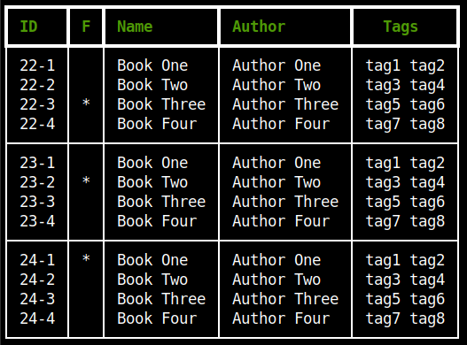

# quotes

Manage your book quotes.

  


## Features

- Manage your book quotes in a simple way
- Search by book name, author, reading year, tag or favorites
- Search a query through all the quotes in the database
- Show a table with all the authors
- Show a table with all the tags

## Dependencies

- [Rich](https://pypi.org/project/rich/)

## Installation

```bash
curl -f https://raw.githubusercontent.com/nonzeroexit/quotes/main/install.sh | sh
```

## Usage

Example files can be found in the examples folder.  
Each year should have a different markdown file, with the YYYY.md format. The .md files have to be written in the following way:

```markdown
#Book Name/Book Author
[tag1,tag2,tag3,...,tagn]

- Quote 1.
  Here you can write your quote.
  You can use more than one line per quote, a new quote only begins with "*"
- Quote 2. You can write as many quotes as you want.
```

Book tags are optional.
To mark a book as favorite, write an * at the end of the title line.

```markdown
#Favorite Book Name/Book Author*
```

## Options

| Options      | Description        | Query                                                                                                  |
| ------------ | ------------------ | ------------------------------------------------------------------------------------------------------ |
| -h, --help   | show help          | -                                                                                                      |
| -b, -books   | search books       | book id, book name, author name, reading year or tag (empty to show all books, favs to show favorites) |
| -q , -quotes | search quotes      | any word                                                                                               |
| -a, -authors | show authors table | -                                                                                                      |
| -t, -tags    | show tags table    | -                                                                                                      |

### Examples

```bash
quotes -b # shows all books
quotes -b 24-2 # shows quotes of book with ID 24-2
quotes -b 2024 # shows books read in 2024
quotes -q life # shows quotes with the word "life" in it
```
